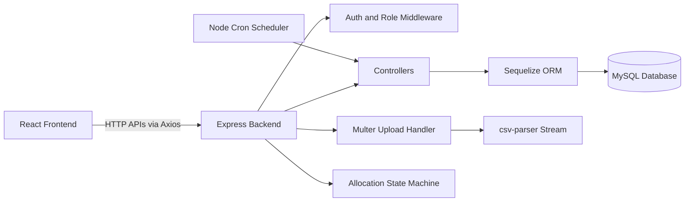

# HostelHub Dashboard - Technical Project Documentation

## 1. Project Summary

HostelHub Dashboard is a full-stack hostel management platform built to digitize and automate core hostel operations for three main roles:
- Student
- Warden
- Admin

This project centralizes:
- role-based access and authentication
- student profile and room lifecycle
- leave approval workflow
- movement tracking (IN and OUT)
- complaint handling workflow
- allocation cycle with merit-based room selection
- dashboard analytics and visual reporting

## 2. What I Have Done In This Project

### 2.1 Backend Implementation

I implemented a modular backend using Express + Sequelize with clear separation of:
- routes
- controllers
- models
- middleware
- cron jobs
- utility state-machine logic

Core backend modules completed:
- Auth module:
  - Student register and login (email or PRN login support)
  - Warden login
  - Admin login via env-based credentials
  - JWT token generation and verification
- Student module:
  - profile fetch and profile update with field allowlist
  - hostel preference update
  - leave apply and leave history
  - complaint create and complaint history
  - movement OUT and IN tracking
  - room availability check and eligible room selection
- Warden module:
  - profile management
  - leave request review and status updates
  - complaint review and status updates
  - student movement monitoring
  - role dashboard stats
- Admin module:
  - dashboard stats endpoint
  - student CRUD and room reassignment
  - warden CRUD
  - complaint monitoring and status lifecycle
  - direct room allocation and room deallocation
- Allocation cycle engine:
  - cycle creation per academic year
  - floors and rooms auto generation
  - fresher room reservation support
  - merit list generation by CGPA
  - eligibility setting
  - open and close room selection window
  - cycle completion
- Data pipeline:
  - CSV upload endpoint for CGPA updates using multer + csv-parser
- Automation:
  - daily cron analytics snapshot generation and upsert

### 2.2 Frontend Implementation

I implemented a React + TypeScript frontend with role-wise dashboards and route guarding.

Major frontend deliverables:
- role-based login flow and protected routes
- dedicated dashboard experiences for Student, Warden, and Admin
- student pages for profile, movement, leave, complaints, and room selection
- warden pages for leave approvals, complaints, and movement monitor
- admin pages for students, wardens, allocation hub, and analytics dashboard
- chart-based visual analytics with Recharts
- API integration using Axios instance and token interceptor

## 3. Detailed Project Flow

### 3.1 Authentication and Authorization Flow

1. User selects role and logs in from frontend.
2. Backend validates credentials in auth controller.
3. JWT token is returned to frontend.
4. Frontend stores token and sends Authorization Bearer token in API calls.
5. Role middleware validates token and role:
   - verifyUser for student routes
   - verifyWarden for warden routes
   - verifyAdmin for admin routes
6. ProtectedRoute in frontend blocks unauthorized route access.

### 3.2 Student Operation Flow

1. Student logs in and lands on student dashboard.
2. Student updates profile with validated allowed fields.
3. Student can submit leave application.
4. Student can mark OUT and then mark IN.
5. Student can raise complaints and track statuses.
6. During open allocation phase, eligible student selects room.

### 3.3 Warden Operation Flow

1. Warden logs in and sees summary dashboard.
2. Warden reviews leave requests and updates status to Approved or Rejected.
3. Warden reviews complaint list and updates status:
   - Open
   - In Progress
   - Resolved
4. Warden tracks student movement feed.

### 3.4 Admin Operation Flow

1. Admin creates allocation cycle for academic year.
2. System auto-creates floors and rooms.
3. Admin uploads CGPA CSV.
4. Admin generates merit list.
5. Admin sets eligible student count.
6. Admin opens room selection window.
7. Students select available rooms.
8. Admin closes selection and completes cycle.
9. Admin monitors dashboards, complaints, students, wardens, and room occupancy.

### 3.5 Allocation State Machine Flow

The allocation lifecycle is controlled by a state-machine:
- draft
- merit_generated
- eligible_set
- selection_open
- selection_closed
- completed

Invalid state transitions are blocked at controller level.

### 3.6 Analytics Flow

1. Backend starts and DB sync/authentication succeeds.
2. Daily cron runs at midnight.
3. Metrics are computed from live tables.
4. Analytics snapshot is upserted in Analytics model.
5. Dashboard endpoints use these metrics for reporting.

## 4. Architecture Overview



## 5. Technologies, Libraries, and Frameworks Used

## 5.1 Frontend Stack
- React 18
- TypeScript
- Vite
- React Router DOM
- TanStack React Query provider integration
- Axios
- Tailwind CSS
- shadcn/ui
- Radix UI
- Lucide React
- Vitest + Testing Library

## 5.2 Backend Stack
- Node.js
- Express
- Sequelize ORM
- MySQL (mysql2 driver)
- JWT (jsonwebtoken)
- bcryptjs
- multer
- csv-parser
- node-cron
- dotenv
- cookie-parser
- cors

## 5.3 Charts Framework Used

Chart framework used in this project:
- Recharts

Chart types used:
- BarChart (admin block occupancy, CGPA distribution)
- AreaChart (student movement trends)
- PieChart (student complaint status)

## 5.4 File Upload Framework Used

File upload and ingestion pipeline:
- multer for multipart file upload handling
- csv-parser for row-by-row CSV streaming
- backend updates student records by PRN

Upload flow:
1. frontend creates FormData and sends file.
2. multer stores file temporarily.
3. csv-parser reads each row.
4. each matching student is updated with CGPA, branch, and year.

## 6. Data Model and Relations

Primary entities:
- Student
- Warden
- Room
- Floor
- AllocationCycle
- StudentAllocation
- RoomSelection
- Movement
- Leave
- Complaint
- Analytics

Important relation groups:
- AllocationCycle -> Floor -> Room
- Student -> Room
- AllocationCycle -> StudentAllocation
- Student -> RoomSelection
- Student -> Movement
- Student -> Leave
- Student -> Complaint
- Warden -> Leave decisions

## 7. API Surface by Role

### Auth APIs
- Student register, login, logout
- Warden login, logout
- Admin login, logout

### Student APIs
- profile get/update
- hostel preference update
- room fetch and room select
- leave apply/list/detail
- complaint create/list/detail
- movement out/in/history

### Warden APIs
- profile get/update
- dashboard stats
- leave list/detail/update
- complaint list/detail/update
- movement monitor

### Admin APIs
- dashboard data
- student management
- warden management
- complaint management
- allocation cycle management
- CGPA CSV upload
- room visualizer data
- allocate or remove student room

## 8. Security and Access Control

- JWT-based authorization for protected routes
- role-specific middleware for route protection
- password hashing with bcryptjs
- role-based frontend route guarding
- input checks at controller level

## 9. Environment Configuration

Backend env variables required:

```env
PORT=5000
DB_NAME=your_db_name
DB_USER=your_db_user
DB_PASSWORD=your_db_password
DB_HOST=your_db_host
DB_PORT=3306
JWT_SECRET=your_jwt_secret
ADMIN_EMAIL=admin@example.com
ADMIN_PASSWORD=strong_password
NODE_ENV=development
```

Frontend env variable:

```env
VITE_BACKEND_URL=http://localhost:5000/api
```

## 10. AI Status in Current Project

Current status:
- There is no active AI or LLM integration in the codebase right now.
- No OpenAI, Gemini, LangChain, or ML inference service is currently wired in runtime.

What exists now is rule-based analytics and business logic.

Potential future AI extension points:
- complaint auto-categorization and priority scoring
- smart room recommendation
- predictive occupancy forecasting
- chatbot assistant for student helpdesk

## 11. How to Run

## Backend
```bash
cd backend
npm install
npm run dev
```

## Frontend
```bash
cd frontend
npm install
npm run dev
```

## Frontend Tests
```bash
cd frontend
npm run test
```

## 12. Technical Highlights

- clear layered architecture with modular controllers
- state-machine controlled allocation lifecycle
- transactional room selection path
- CSV data ingestion for bulk academic updates
- automated daily analytics job
- role-based dashboards with chart visualizations
- scalable route separation by role

## 13. Suggested Future Improvements

- add request validation with zod or joi on backend
- centralize error handling middleware
- add structured logging and observability
- improve token lifecycle with refresh token strategy
- add integration and unit tests for allocation and auth paths
- add real AI service integration for complaint intelligence

Live link: https://pccoehostelhub.vercel.app/

